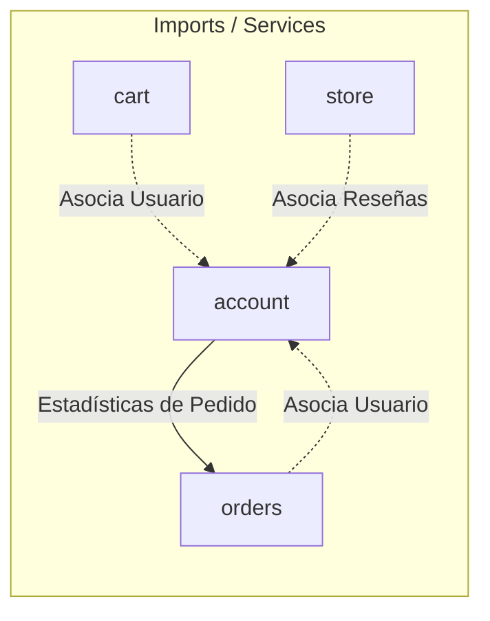

# 📦 Módulo Account — Cerebro Local

## 🎯 Propósito
Este módulo gestiona la autenticación de usuarios, registro, perfiles y recuperación de contraseñas de los clientes en la tienda. Extiende el modelo User de Django con una cuenta personalizada (`Account`) y un perfil asociado (`UserProfile`).

## 🕸️ Grafo de Dependencias (Codebase Graph)

*   **Entidades dependientes de este módulo:** 
    *   [store](../store/README.md) (Vincula reviews a cuentas de usuario)
    *   [cart](../cart/README.md) (Vincula carritos de compra a cuentas de usuario)
    *   [orders](../orders/README.md) (Vincula pedidos y facturación a cuentas de usuario)
*   **Módulos requeridos por este módulo:** 
    *   [orders](../orders/README.md) (Para consolidar estadísticas en el Dashboard de usuario)

## 🛠️ Modelos Clave / Entidades (DB)
- **Account** (Hereda de `AbstractBaseUser`): Reemplaza el modelo de autenticación por defecto de Django utilizando el `email` como identificador principal. Almacena nombres, teléfono, fecha de registro y flags de permisos (`is_admin`, `is_staff`, `is_active`).
- **UserProfile** (Hereda de `models.Model`): Relación One-to-One con `Account`. Almacena datos adicionales como dirección de entrega, ciudad, estado, país y foto de perfil (`profile_picture`).

## ⚡ Servicios y Casos de Uso Críticos (services.py)
- **AccountRegistrationService**: Registra usuarios, crea su perfil base y despacha correos de verificación.
- **AccountLoginService**: Valida credenciales e inicia sesión.
- **PasswordResetService**: Genera tokens criptográficos temporales y maneja el flujo de recuperación de contraseña.
- **ProfileUpdateService**: Actualiza información personal, dirección y foto de perfil del usuario.
- **AccountActivationService**: Activa la cuenta verificando el token recibido por email.
- **PasswordChangeService**: Cambia contraseñas para usuarios logueados.
- **DashboardService**: Recopila las estadísticas de pedidos (`orders_count`, `new_orders_count`, etc.) para renderizar en el panel de control del usuario.
