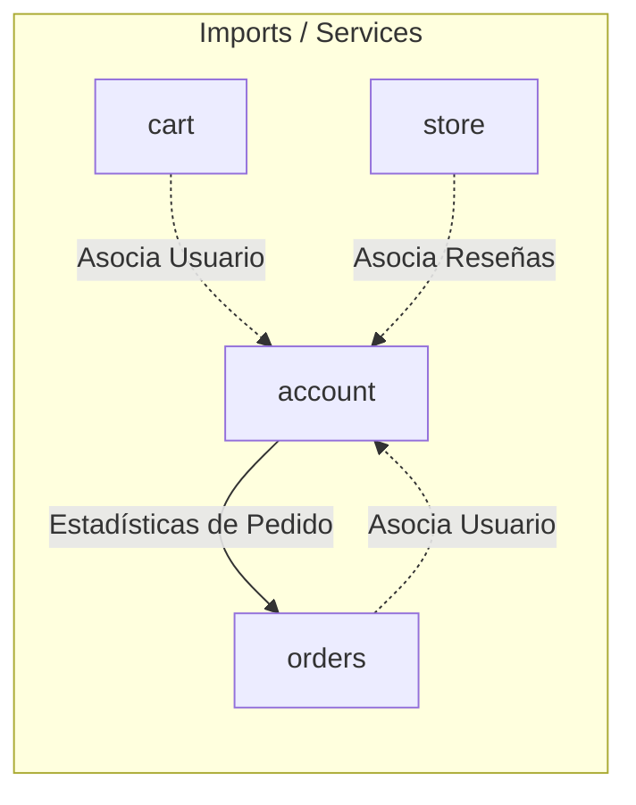

# 📦 Módulo Account — Cerebro Local

## 🎯 Propósito
Este módulo gestiona la autenticación de usuarios, registro, perfiles y recuperación de contraseñas de los clientes en la tienda. Extiende el modelo User de Django con una cuenta personalizada (`Account`) y un perfil asociado (`UserProfile`).

## 🕸️ Grafo de Dependencias (Codebase Graph)

*   **Entidades dependientes de este módulo:** 
    *   [store](../store/README.md) (Vincula reviews a cuentas de usuario)
    *   [cart](../cart/README.md) (Vincula carritos de compra a cuentas de usuario)
    *   [orders](../orders/README.md) (Vincula pedidos y facturación a cuentas de usuario)
*   **Módulos requeridos por este módulo:** 
    *   [orders](../orders/README.md) (Para consolidar estadísticas en el Dashboard de usuario)

```mermaid
graph LR
    subgraph Imports / Services
        account[account]
        orders[orders]
        cart[cart]
        store[store]
        
        account -->|Estadísticas de Pedido| orders
        cart -.->|Asocia Usuario| account
        orders -.->|Asocia Usuario| account
        store -.->|Asocia Reseñas| account
    end
```

## 🛠️ Modelos Clave / Entidades (DB)
- **Account** (Hereda de `AbstractBaseUser`): Reemplaza el modelo de autenticación por defecto de Django utilizando el `email` como identificador principal. Almacena nombres, teléfono, fecha de registro y flags de permisos (`is_admin`, `is_staff`, `is_active`).
- **UserProfile** (Hereda de `models.Model`): Relación One-to-One con `Account`. Almacena datos adicionales como dirección de entrega, ciudad, estado, país y foto de perfil (`profile_picture`).

## ⚡ Servicios y Casos de Uso Críticos (services.py)
- **AccountRegistrationService**: Registra usuarios, crea su perfil base y despacha correos de verificación.
- **AccountLoginService**: Valida credenciales e inicia sesión.
- **PasswordResetService**: Genera tokens criptográficos temporales y maneja el flujo de recuperación de contraseña.
- **ProfileUpdateService**: Actualiza información personal, dirección y foto de perfil del usuario.
- **AccountActivationService**: Activa la cuenta verificando el token recibido por email.
- **PasswordChangeService**: Cambia contraseñas para usuarios logueados.
- **DashboardService**: Recopila las estadísticas de pedidos (`orders_count`, `new_orders_count`, etc.) para renderizar en el panel de control del usuario.

## 🛡️ Controles de Seguridad (AppSec & Hardening)
- **Protección contra Open Redirect**: `AccountLoginService.resolve_safe_redirect` valida que cualquier parámetro `next` pertenezca al host autorizado y esquema seguro antes de redirigir.
- **Defensa contra Enumeración de Cuentas**: `forgotPassword` (Web) y `PasswordResetViewSet.request_reset` (API) emiten respuestas genéricas unificadas sin revelar si una dirección de email existe.
- **Rate Limiting Dedicado**: Clases de throttling por alcance en `account/api/throttling.py` (`LoginRateThrottle`, `RegisterRateThrottle`, `PasswordResetRateThrottle`) limitan abusos y fuerza bruta.
- **Validación Estricta de Contraseñas**: Toda creación o reseteo de contraseña ejecuta la suite completa de `AUTH_PASSWORD_VALIDATORS` de Django.
- **Aislamiento y Purga de Sesión**: La vista `resetPassword` exige sesión activa y elimina `uid` de `request.session` inmediatamente tras el cambio exitoso.
- **Sanitización y Validación Estricta de Cargas de Medios (SEC-INF-001/007)**: El campo `profile_picture` en `UserProfile` y `UserProfileForm` implementa `FileExtensionValidator` con whitelist estricta (`jpg`, `jpeg`, `png`, `webp`) y `validate_image_file` con análisis de magic bytes mediante Pillow para prevenir evasiones hacia `/var/www/shared/media/` o ejecución remota. La vista `edit_profile` delega la persistencia de datos y medios a `ProfileUpdateService` (en lugar de `form.save()` directo).
- **Preservación Contable e Integridad de Facturación**: Relación desacoplada con `OrderProduct` (`on_delete=models.SET_NULL, null=True`) en `orders`. Esto permite eliminar de forma segura cuentas spam o usuarios sin corromper el detalle histórico de facturación comercial.
- **Suite de Pruebas**: Tests automatizados en `account/tests/` (59 tests) cubriendo registro, autenticación segura, reseteo de contraseña, mitigación de enumeración, validación de sesiones y validación de seguridad en uploads.
