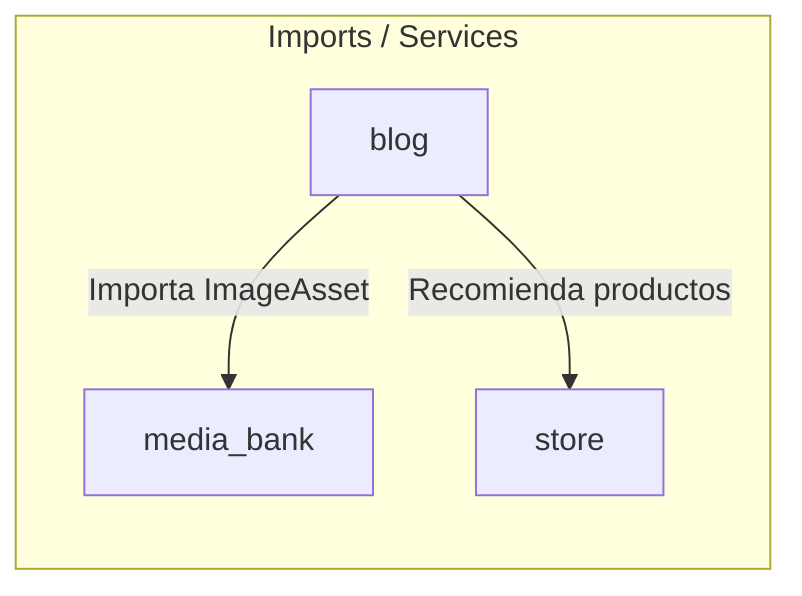

# 📦 Módulo Blog — Cerebro Local

## 🎯 Propósito
Este módulo implementa el blog corporativo de la tienda, optimizado para captación de tráfico mediante contenidos SEO y la integración de contenido de redes sociales (Instagram/Facebook/TikTok) a través de metadata social enriquecida.

## 🕸️ Grafo de Dependencias (Codebase Graph)

*   **Entidades dependientes de este módulo:** Ninguno.
*   **Módulos requeridos por este módulo:** 
    *   [media_bank](../media_bank/README.md) (Utiliza ImageAsset para la imagen destacada de los posts)
    *   [store](../store/README.md) (Permite asociar productos sugeridos a los artículos del blog)

## 🛠️ Modelos Clave / Entidades (DB)
- **Post** (Hereda de `models.Model`): Modela un artículo del blog. Admite artículos de redacción original (`article`) o reposiciones de redes (`social_repost`). Integra campos SEO (`meta_title`, `meta_description`, `meta_keywords`), autor, contador de vistas, fecha programada (`published_date`) y banderas de estado (`is_published`).
- **PostTag** (Hereda de `models.Model`): Etiquetas de organización para taxonomía del blog.
- **SocialMetadata** (Hereda de `models.Model`): Relación One-to-One con `Post`. Contiene campos específicos para reposts de redes sociales (`social_network`, `post_url`, `author_username`, `video_id` para TikTok/Reels) que permiten renderizar reproductores interactivos incrustados.

## ⚡ Servicios y Casos de Uso Críticos (services.py)
- **BlogService.get_published_posts**: Obtiene posts publicados ordenados por fecha de publicación. Aplica filtrado por fecha programada (`published_date__lte=timezone.now()`) para habilitar la publicación diferida (scheduling).
- **BlogService.get_post_by_slug**: Resuelve el detalle de un post según su slug único.
- **BlogService.get_related_posts**: Obtiene una lista de hasta 3 posts relacionados basándose en la coincidencia de tags en común.
- **BlogService.increment_views**: Incrementa de forma segura el contador de visitas (`view_count`) en la base de datos usando expresiones `F()` para evitar race conditions.
- **BlogService.search_posts**: Implementa una búsqueda de texto completo sobre títulos y contenidos del blog.

## 📝 Notas de Detalle (Obsidian Vault)
- **Validación Social**: El método `clean()` de `Post` restringe las reglas de negocio; no se permite guardar un post con tipo `social_repost` si no se ha asignado y completado su modelo relacionado `SocialMetadata`.
