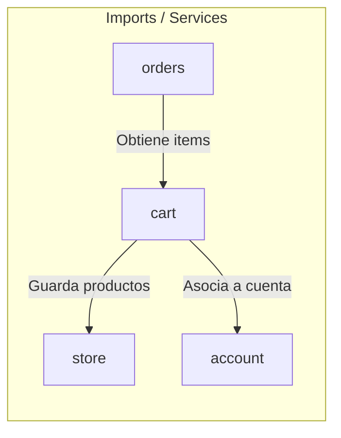

# 📦 Módulo Cart — Cerebro Local

## 🎯 Propósito
Este módulo implementa el carrito de compras del sitio. Gestiona la agregación, actualización y remoción de productos (y sus variaciones), unificando de manera transparente la lógica para visitantes anónimos (basado en sesión) y usuarios autenticados (guardado en BD).

## 🕸️ Grafo de Dependencias (Codebase Graph)

*   **Entidades dependientes de este módulo:** 
    *   [orders](../orders/README.md) (Requiere el contenido del carrito para iniciar el checkout y generar pedidos)
*   **Módulos requeridos por este módulo:** 
    *   [store](../store/README.md) (Define `Product` y `Variation` que se guardan en el carrito)
    *   [account](../account/README.md) (Modela el `Account` al que se asocian las compras)

## 🛠️ Modelos Clave / Entidades (DB)
- **Cart** (Hereda de `models.Model`): Modela el carro de compras para usuarios anónimos a través de un `cart_id` ligado al identificador de la sesión de Django (`session_key`).
- **CartItem** (Hereda de `models.Model`): Vincula los productos agregados al carro. Soporta ForeignKey a `Account` (usuario autenticado), ForeignKey a `Cart` (usuario anónimo), ForeignKey a `Product`, cantidad, variación elegida (`Variation` Many-to-Many) y el precio de compra en el momento de agregado (`purchase_price` congelado).

## ⚡ Servicios y Casos de Uso Críticos (services.py)
- **CartService.get_or_create_cart_id**: Inicializa u obtiene de forma segura la sesión del visitante para identificar su carrito.
- **CartService.get_cart_items**: Recupera los items del carro activos. Si el usuario está logueado, prioriza la consulta por clave de usuario; de lo contrario, por el ID de sesión.
- **CartService.calculate_cart_totals**: Calcula de manera centralizada la cantidad de artículos y el total del carrito.
- **CartService.add_to_cart**: Añade un producto o incrementa su cantidad. Compara las combinaciones de variaciones existentes para decidir si incrementa un item existente o añade una nueva línea.
- **CartService.merge_cart_on_login**: Resuelve la conciliación al iniciar sesión. Traspasa los items del carrito anónimo al carrito persistente de la cuenta de usuario, unificando duplicados y limpiando la sesión previa.

## 📝 Notas de Detalle (Obsidian Vault)
- **Precio Fijo de Compra (Fase 1C)**: Al crearse un `CartItem`, su `purchase_price` se congela según el valor actual (`price` o `sale_price` si está en promoción). Esto previene que alteraciones de precios en el catálogo alteren carritos ya en proceso de compra.
