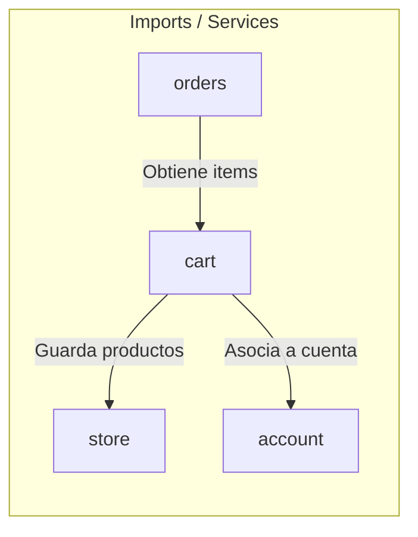

# 📦 Módulo Cart — Cerebro Local

## 🎯 Propósito
Este módulo implementa el carrito de compras del sitio. Gestiona la agregación, actualización y remoción de productos (y sus variaciones), unificando de manera transparente la lógica para visitantes anónimos (basado en sesión) y usuarios autenticados (guardado en BD).

## 🕸️ Grafo de Dependencias (Codebase Graph)

*   **Entidades dependientes de este módulo:** 
    *   [orders](../orders/README.md) (Requiere el contenido del carrito para iniciar el checkout y generar pedidos)
*   **Módulos requeridos por este módulo:** 
    *   [store](../store/README.md) (Define `Product` y `Variation` que se guardan en el carrito)
    *   [account](../account/README.md) (Modela el `Account` al que se asocian las compras)

```mermaid
graph LR
    subgraph Imports / Services
        cart[cart]
        store[store]
        account[account]
        orders[orders]
        
        cart -->|Guarda productos| store
        cart -->|Asocia a cuenta| account
        orders -->|Obtiene items| cart
    end
```

## 🛠️ Modelos Clave / Entidades (DB)
- **Cart** (Hereda de `models.Model`): Modela el carro de compras para usuarios anónimos a través de un `cart_id` ligado al identificador de la sesión de Django (`session_key`).
- **CartItem** (Hereda de `models.Model`): Vincula los productos agregados al carro. Soporta ForeignKey a `Account` (usuario autenticado), ForeignKey a `Cart` (usuario anónimo), ForeignKey a `Product`, cantidad, variación elegida (`Variation` Many-to-Many) y el precio de compra en el momento de agregado (`purchase_price` como `DecimalField(max_digits=12, decimal_places=2)` congelado).

## ⚡ Servicios y Casos de Uso Críticos (services.py)
- **CartService.get_or_create_cart_id**: Inicializa u obtiene de forma segura la sesión del visitante para identificar su carrito.
- **CartService.get_cart_items**: Recupera los items del carro activos. Si el usuario está logueado, prioriza la consulta por clave de usuario; de lo contrario, por el ID de sesión.
- **CartService.calculate_cart_totals**: Calcula de manera centralizada la cantidad de artículos y el total del carrito.
- **CartService.add_to_cart**: Añade un producto o incrementa su cantidad. Compara las combinaciones de variaciones existentes para decidir si incrementa un item existente o añade una nueva línea. Aplica validación estricta y clamping defensivo de cantidad `[1, 1000]`.
- **CartService.merge_cart_on_login**: Resuelve la conciliación al iniciar sesión. Traspasa los items del carrito anónimo al carrito persistente de la cuenta de usuario, unificando duplicados y limpiando la sesión previa.

## 📝 Notas de Detalle (Obsidian Vault)
- **Precio Fijo de Compra (Fase 1C & Hardening)**: Al crearse un `CartItem`, su `purchase_price` se congela según el valor actual (`price` o `sale_price` si está en promoción) utilizando `DecimalField(max_digits=12, decimal_places=2)`. Esto elimina discrepancias de redondeo en flotantes y previene que alteraciones de catálogo afecten compras en curso.
- **Seguridad y Hardening (AppSec - Fases 19 y 21)**:
  - **Mitigación CSRF vía GET (AUD-CART-001)**: Operaciones de mutación de estado (`add_cart`, `remove_cart`, `remove_cart_item`) restringidas con `@require_POST`. Los componentes interactivos de frontend (Alpine.js en `_product_grid_item.html` y formularios en `cart.html`/`_cart_item_row.html`) fueron adaptados a peticiones POST acompañadas del token CSRF (`X-CSRFToken` / ``).
  - **Precisión Financiera (AUD-CART-002)**: Migración de `purchase_price` de `FloatField` a `DecimalField(max_digits=12, decimal_places=2)`.
  - **Open Redirect (SEC-103)**: `add_cart` valida `HTTP_REFERER` mediante `url_has_allowed_host_and_scheme(allowed_hosts={request.get_host()})` bloqueando phishing tras añadir productos al carrito.
  - **Input Validation y Clamping Centralizado (SEC-108)**: Validación defensiva contra strings no numéricos y restricción estricta de cantidad al rango seguro `[1, 1000]` centralizada en la capa de servicios (`CartService.add_to_cart`).
  - **Suite de Pruebas**: Tests unitarios y de integración en `cart/tests/` garantizando cobertura de métodos HTTP, validación y seguridad.

