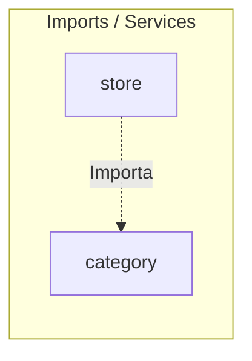

# 📦 Módulo Category — Cerebro Local

## 🎯 Propósito
Este módulo gestiona la jerarquía de categorización de los productos de la tienda online (Categorías y Subcategorías), su optimización SEO semántica y la configuración dinámica del menú de navegación.

## 🕸️ Grafo de Dependencias (Codebase Graph)

*   **Entidades dependientes de este módulo:** 
    *   [store](../store/README.md) (Vincula productos a categorías y subcategorías)
    *   [media_bank](../media_bank/README.md) (Recibe ImageAsset para asignación de imágenes)
*   **Módulos requeridos por este módulo:** Ninguno (Módulo hoja, independiente).

## 🛠️ Modelos Clave / Entidades (DB)
- **Category** (Hereda de `models.Model`): Define las categorías principales. Incluye campos SEO (`meta_title`, `meta_description`, `rich_description`) y vinculación con banco de imágenes (`image` FK a `media_bank.ImageAsset`).
- **SubCategory** (Hereda de `models.Model`): Subcategorías asociadas a una categoría padre con relación One-to-Many (`category`).
- **FeaturedCategory** (Hereda de `models.Model`): Destaca categorías en la Home Page, permitiendo ordenarlas dinámicamente (`position`).
- **NavbarItem** (Hereda de `models.Model`): Configuración dinámica de los elementos expuestos en la barra de navegación del sitio.

## ⚡ Servicios y Casos de Uso Críticos (services.py)
- **CategoryService.get_all_categories**: Obtiene todas las categorías con sus subcategorías precargadas en memoria (`prefetch_related`) para evitar consultas N+1.
- **CategoryService.get_category_by_slug**: Obtiene una categoría específica y sus subcategorías utilizando el slug.
- **CategoryService.get_featured_categories**: Obtiene categorías destacadas ordenadas por posición para la Home.
- **CategoryService.get_navbar_items**: Obtiene los ítems activos del navbar.
- **SubCategoryService.get_subcategory_by_slug**: Obtiene una subcategoría específica resolviendo mediante el slug de su categoría padre y de sí misma.

## 📝 Notas de Detalle (Obsidian Vault)
- **Autollenado SEO**: El método `save()` de `Category` y `SubCategory` autocompleta el `meta_title` y `meta_description` utilizando plantillas locales si no se completan manualmente en el admin.
