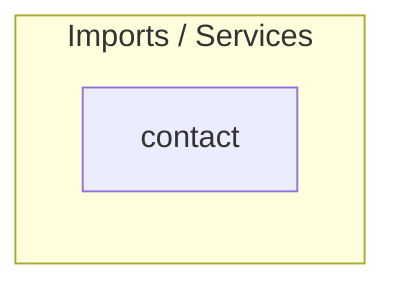

# 📦 Módulo Contact — Cerebro Local

## 🎯 Propósito
Este módulo gestiona el formulario de contacto público del sitio, permitiendo a los usuarios enviar mensajes e iniciar solicitudes de comunicación mediante correo electrónico o WhatsApp.

## 🕸️ Grafo de Dependencias (Codebase Graph)

*   **Entidades dependientes de este módulo:** Ninguno.
*   **Módulos requeridos por este módulo:** Ninguno (Módulo hoja independiente).

## 🛠️ Modelos Clave / Entidades (DB)
- **ContactOption** (Hereda de `models.Model`): Modela un mensaje de contacto enviado por el usuario. Registra `name`, `email`, `contact_method` (correo o WhatsApp), `subject`, `message` y la fecha de creación.

## ⚡ Servicios y Casos de Uso Críticos (services.py)
- **ContactService.create_contact**: Valida los campos obligatorios del contacto y rutea el procesamiento según el canal elegido (`email` o `whatsapp`).
- **ContactService.send_email_notification**: Formatea y despacha la notificación por correo electrónico hacia el buzón de la administración (`settings.CONTACT_EMAIL`) utilizando `settings.DEFAULT_FROM_EMAIL`.
- **ContactService.process_whatsapp_contact**: Registra y procesa los eventos de contacto iniciados a través de WhatsApp.
