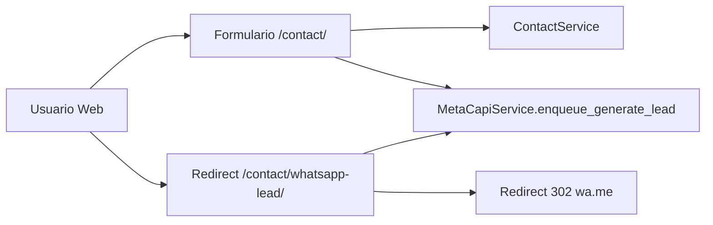

# 📦 Módulo Contact — Cerebro Local

## 🎯 Propósito
Este módulo gestiona el formulario de contacto público del sitio, permitiendo a los usuarios enviar mensajes e iniciar solicitudes de comunicación mediante correo electrónico o WhatsApp.

## 🕸️ Grafo de Dependencias (Codebase Graph)

*   **Entidades dependientes de este módulo:** Ninguno.
*   **Módulos requeridos por este módulo:** `tracking` ([MetaCapiService](../tracking/README.md)), `web_bulonera.utils` (`get_client_ip`).

```mermaid
graph LR
    User[Usuario Web] --> Form[Formulario /contact/]
    User --> WALink[Redirect /contact/whatsapp-lead/]
    Form --> ContactService[ContactService]
    Form --> CAPI[MetaCapiService.enqueue_generate_lead]
    WALink --> CAPI
    WALink --> WA[Redirect 302 wa.me]
```

## 🛠️ Modelos Clave / Entidades (DB)
- **ContactOption** (Hereda de `models.Model`): Modela un mensaje de contacto enviado por el usuario. Registra `name`, `email`, `contact_method` (correo o WhatsApp), `subject`, `message` y la fecha de creación.

## 🌐 Vistas Web y Controladores (web/views/views.py)
- **`contact_view`**: Formulario web con rate-limiting por IP (Redis), trampa honeypot invisible anti-spam, persistencia y despacho del evento CAPI `Lead` (`lead_method="contact_form"`).
- **`contact_success`**: Vista de confirmación de envío.
- **`whatsapp_lead_redirect`**: Proxy interno first-party para todos los enlaces a WhatsApp del sitio. Captura el `event_id` provisto por el frontend (o genera uno nuevo), despacha el evento CAPI `Lead` en segundo plano con el parámetro `source` de atribución (ej. `product_detail`, `blog_cta`, `floating`, `navbar`, `footer`), y emite un HTTP 302 hacia `https://wa.me/{WHATSAPP_NUMBER}?text=...`.

## ⚡ Servicios y Casos de Uso Críticos (services.py)
- **ContactService.create_contact**: Valida los campos obligatorios del contacto y rutea el procesamiento según el canal elegido (`email` o `whatsapp`).
- **ContactService.send_email_notification**: Formatea y despacha la notificación por correo electrónico hacia el buzón de la administración (`settings.CONTACT_EMAIL`) utilizando `settings.DEFAULT_FROM_EMAIL`.
- **ContactService.process_whatsapp_contact**: Registra y procesa los eventos de contacto iniciados a través de WhatsApp.
- **ContactService.check_rate_limit**: Limita envíos reiterados por IP para mitigar abusos y saturación.

