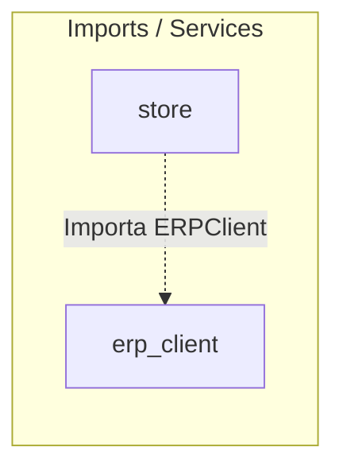

# 📦 Módulo ERP Client — Cerebro Local

## 🎯 Propósito
Este módulo encapsula el cliente HTTP de comunicación de bajo nivel con el ERP de la empresa. Funciona como una capa de transporte pura para intercambio de datos (productos, stock, categorías, autenticación JWT) libre de lógica de negocio.

## 🕸️ Grafo de Dependencias (Codebase Graph)

*   **Entidades dependientes de este módulo:** 
    *   [store](../store/README.md) (Requiere `ERPClient` para sincronizar/importar datos en el backend de la tienda)
*   **Módulos requeridos por este módulo:** Ninguno.

## 🛠️ Modelos Clave / Entidades (DB)
Este módulo no posee tablas en base de datos.
- **Exceptions**: Posee excepciones personalizadas (`ERPUnavailableError`, `ERPAuthError`) en `exceptions.py` para aislar fallas de conexión de red del ERP.

## ⚡ Servicios y Casos de Uso Críticos (client.py)
- **ERPClient.get_products**: Stub HTTP para obtener productos remotos (dispara NotImplementedError en Fase 3A; migra a REST + JWT en Fase 3B).
- **ERPClient.get_stock**: Obtiene stock en tiempo real de un producto por código.
- **ERPClient.update_stock**: Actualiza cantidades físicas en el ERP.
- **ERPClient.authenticate**: Inicializa el token handshake con la API externa.

## 📝 Notas de Detalle (Obsidian Vault)
- **Estado de Fase 3A**: Actualmente es un stub listo para ser rellenado. Las importaciones se realizan localmente mediante archivos Excel procesados en el comando de consola de `store`.
