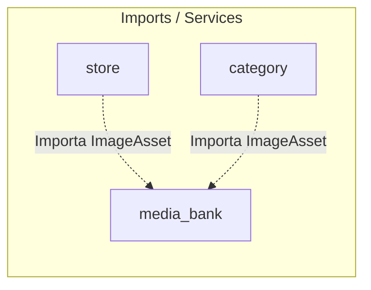

# 📦 Módulo Media Bank — Cerebro Local

## 🎯 Propósito
Este módulo implementa el banco centralizado de imágenes del sitio, administrando la carga, clasificación y asignación de imágenes (`product`, `category`, `subcategory`, `carousel`, `banner`) con un pipeline de conversión WebP.

## 🕸️ Grafo de Dependencias (Codebase Graph)

*   **Entidades dependientes de este módulo:** 
    *   [store](../store/README.md) (Utiliza ImageAsset para galerías de productos, banners de Home y carruseles)
    *   [category](../category/README.md) (Asocia categorías y subcategorías con ImageAsset)
*   **Módulos requeridos por este módulo:** Ninguno (Módulo de infraestructura core).

## 🛠️ Modelos Clave / Entidades (DB)
- **ImageAsset** (Hereda de `models.Model`): Modela una imagen cargada en el banco. Almacena `image_type` (elección de tipo), el archivo físico (`file`), el `name` descriptivo, `alt_text` (SEO) y `uploaded_at`. Rutea el archivo mediante `image_asset_upload_path` según el tipo.
- **ImageType** (Hereda de `models.TextChoices`): Define los tipos soportados: `product`, `category`, `subcategory`, `carousel` y `banner`.

## ⚡ Servicios y Casos de Uso Críticos (services.py)
- **MediaBankService.create_image**: Almacena un archivo de imagen en el banco con su clasificación correspondiente.
- **MediaBankService.get_images_by_type**: Filtra colecciones de imágenes según el tipo especificado ordenadas por fecha de carga de forma descendente.
- **MediaBankService.get_all_images**: Devuelve el inventario total de imágenes del banco centralizado.

## 📝 Notas de Detalle (Obsidian Vault)
- **WebP URL Candidate Resolver**: `ImageAsset.get_webp_url()` intenta localizar la versión en WebP generada de manera automática. Tiene soporte legacy para directorios del tipo `photos/products/webp/lg/` garantizando retrocompatibilidad en el VPS.
