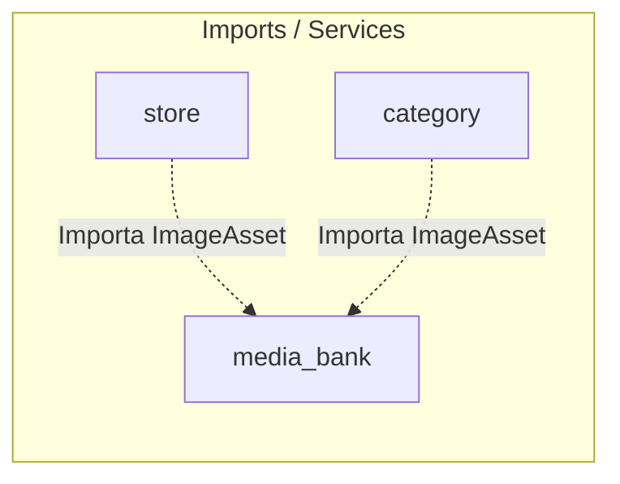

# 📦 Módulo Media Bank — Cerebro Local

## 🎯 Propósito
Este módulo implementa el banco centralizado de imágenes del sitio, administrando la carga, clasificación y asignación de imágenes (`product`, `category`, `subcategory`, `carousel`, `banner`) con un pipeline de conversión WebP asíncrono y hardening integral de seguridad.

## 🕸️ Grafo de Dependencias (Codebase Graph)

*   **Entidades dependientes de este módulo:** 
    *   [store](../store/README.md) (Utiliza ImageAsset para galerías de productos, banners de Home y carruseles)
    *   [category](../category/README.md) (Asocia categorías y subcategorías con ImageAsset)
*   **Módulos requeridos por este módulo:** Ninguno (Módulo de infraestructura core).

```mermaid
graph LR
    subgraph Imports / Services
        media_bank[media_bank]
        store[store] -.->|Importa ImageAsset| media_bank
        category[category] -.->|Importa ImageAsset| media_bank
    end
```

## 🛠️ Modelos Clave / Entidades (DB)
- **ImageAsset** (Hereda de `models.Model`): Modela una imagen cargada en el banco. Almacena `image_type` (elección de tipo), el archivo físico (`file`), el `name` descriptivo, `alt_text` (SEO) y `uploaded_at`. Rutea el archivo mediante `image_asset_upload_path` según el tipo con confinamiento estricto de rutas.
- **ImageType** (Hereda de `models.TextChoices`): Define los tipos soportados: `product`, `category`, `subcategory`, `carousel` y `banner`.

## 🛡️ Seguridad y Robustez Implementada (Remediación Fase 1-3)
- **Confinamiento Path Traversal (AUD-MB-001 / CWE-22)**: `overwrite_upload_path` valida y restringe con `Path.resolve()` y `relative_to(settings.MEDIA_ROOT)`. Rechaza rutas absolutas o intentos de evasión con `SuspiciousFileOperation`.
- **Sanitización de Archivos y Magic Bytes**: `create_clean_filename` normaliza caracteres a ASCII y minúsculas; `validate_image_file` valida tamaño máximo (10MB), extensiones en lista blanca (`.jpg`, `.jpeg`, `.png`, `.webp`, `.gif`) y verificación estructural binaria con Pillow (`verify()`).
- **Prevención Stored XSS (AUD-MB-002)**: Eliminado el uso de `mark_safe` con f-strings en `media_bank/admin.py` y `store/admin.py`. Se utiliza `format_html` canónico de Django para escapar URLs y metadatos.
- **Transaccionalidad en Celery (AUD-MB-003)**: Señal `post_save` envuelta con `transaction.on_commit()` eliminando race condition de lectura en Celery antes del commit en MariaDB.
- **Mitigación DoS en Workers (AUD-MB-004)**: Eliminado el fallback de compresión síncrona en `ImageAsset.get_webp_url()`. El worker HTTP no se bloquea y retorna `None` inmediatamente si Celery aún no procesó la imagen.

## ⚡ Servicios y Casos de Uso Críticos (services.py)
- **MediaBankService.create_image**: Valida con `image_asset.full_clean()` dentro de un bloque `transaction.atomic()` y persiste el archivo en el banco con defaults automáticos.
- **MediaBankService.get_images_by_type**: Filtra colecciones de imágenes según el tipo especificado ordenadas por fecha de carga de forma descendente.
- **MediaBankService.get_all_images**: Devuelve el inventario total de imágenes del banco centralizado.

## 🧪 Cobertura de Tests
- `tests/test_models.py`: Pruebas de entidad, autogeneración de metadatos SEO/GEO/AEO, resolución WebP anti-DoS y validadores de modelo.
- `tests/test_services.py`: Pruebas de contrato del servicio, aislamiento transaccional y rollback ante errores de validación.
- `tests/test_security.py`: Pruebas exhaustivas contra Path Traversal, detección de Magic Bytes corruptos/falsificados, y escape HTML contra Stored XSS.
