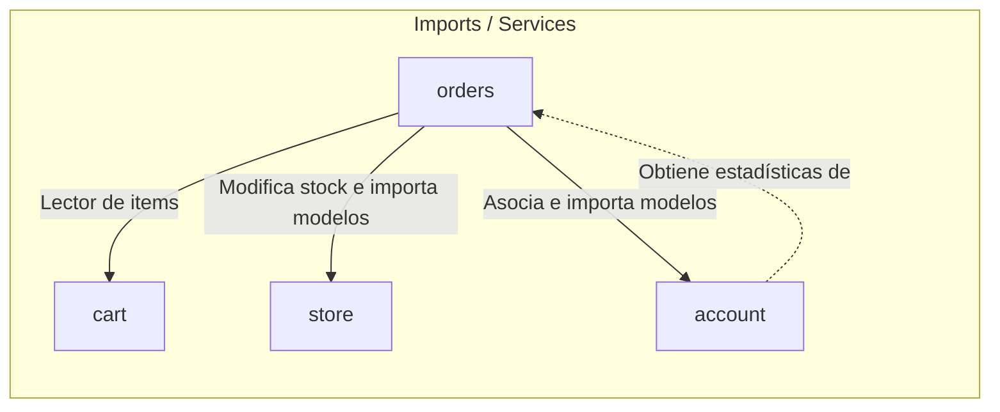

# 📦 Módulo Orders — Cerebro Local

## 🎯 Propósito
Este módulo gestiona la creación de órdenes de compra, el procesamiento de pagos (tanto en pasarela digital como vía WhatsApp) y la deducción de inventarios en el momento de concretar la transacción.

## 🕸️ Grafo de Dependencias (Codebase Graph)

*   **Entidades dependientes de este módulo:** 
    *   [account](../account/README.md) (Requiere consultar órdenes del usuario para armar las estadísticas de su panel de control)
*   **Módulos requeridos por este módulo:** 
    *   [cart](../cart/README.md) (Requiere el contenido del carrito de compras para transformarlo en líneas de pedido)
    *   [store](../store/README.md) (Vincula a los productos y sus variaciones vendidas)
    *   [account](../account/README.md) (Vincula la orden y los pagos a la cuenta del usuario)

## 🛠️ Modelos Clave / Entidades (DB)
- **Order** (Hereda de `models.Model`): Modela la cabecera de una compra. Almacena el número de orden (`order_number` con formato de fecha + ID), datos de facturación/envío, estado (`New`, `Accepted`, `Completed`, `Cancelled`), total de la compra y la llave foránea al pago.
- **Payment** (Hereda de `models.Model`): Registra la transacción de cobro. Vincula el ID del pago remoto, método de pago, monto total y estado.
- **OrderProduct** (Hereda de `models.Model`): Through model que representa cada producto individual comprado. Congela el precio de venta en `purchase_price` y mapea las variaciones (`Variation`) asociadas.

## ⚡ Servicios y Casos de Uso Críticos (services.py)
- **OrderService.create_order_from_cart**: Crea la cabecera de la orden y genera los `OrderProduct` correspondientes a partir del contenido actual del carrito.
- **OrderService.generate_order_number**: Genera de forma predecible un código único de orden `YYYYMMDD{id}`.
- **PaymentService.process_payment**: Registra la aprobación del pago, marca la orden como completada (`is_ordered=True`), vincula el ID de transacción y descuenta el stock físico de los productos comprados.
- **PaymentService.create_whatsapp_payment**: Registra un pago pendiente con método "WhatsApp".
- **CheckoutService.complete_checkout**: Orquesta el flujo completo de checkout transaccional: valida stock, crea la orden, limpia los items del carrito e inicia el envío del mail de confirmación.
- **WhatsAppService.generate_whatsapp_link**: Construye un enlace dinámico hacia el número de soporte de la empresa (`settings.WHATSAPP_NUMBER`) con un mensaje estructurado en Markdown que detalla los productos comprados, cantidades, variaciones y total del pedido.

## 📝 Notas de Detalle (Obsidian Vault)
- **Atomicidad en Inventarios**: Los métodos `process_payment` y `process_whatsapp_order` corren bajo el decorador `@transaction.atomic` de Django para asegurar que el descuento de stock de productos y la creación de registros de pago no queden en un estado inconsistente en caso de fallos.
