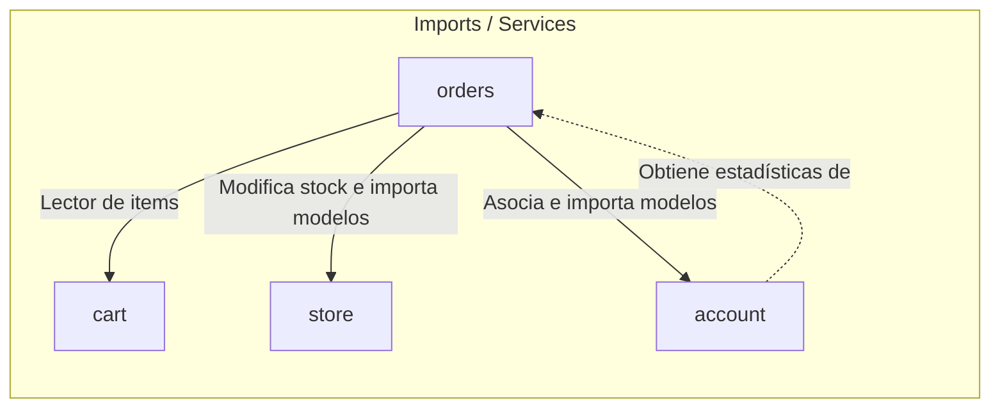

# 📦 Módulo Orders — Cerebro Local

## 🎯 Propósito
Este módulo gestiona la creación de órdenes de compra, el procesamiento de pagos (tanto en pasarela digital como vía WhatsApp) y la deducción de inventarios en el momento de concretar la transacción.

## 🕸️ Grafo de Dependencias (Codebase Graph)

*   **Entidades dependientes de este módulo:** 
    *   [account](../account/README.md) (Requiere consultar órdenes del usuario para armar las estadísticas de su panel de control)
*   **Módulos requeridos por este módulo:** 
    *   [cart](../cart/README.md) (Requiere el contenido del carrito de compras para transformarlo en líneas de pedido)
    *   [store](../store/README.md) (Vincula a los productos y sus variaciones vendidas)
    *   [account](../account/README.md) (Vincula la orden y los pagos a la cuenta del usuario)

```mermaid
graph LR
    subgraph Imports / Services
        orders[orders]
        cart[cart]
        store[store]
        account[account]
        
        orders -->|Lector de items| cart
        orders -->|Modifica stock e importa modelos| store
        orders -->|Asocia e importa modelos| account
        account -.->|Obtiene estadísticas de| orders
    end
```

## 🛠️ Modelos Clave / Entidades (DB)
- **Order** (Hereda de `models.Model`): Modela la cabecera de una compra. Almacena el número de orden (`order_number` único con índice de BD `db_index=True`), datos de facturación/envío (`state` con `max_length=10` compatible con CPA argentino), estado (`New`, `Accepted`, `Completed`, `Cancelled`), total de la compra como `DecimalField(max_digits=12, decimal_places=2)` y la llave foránea al pago.
- **Payment** (Hereda de `models.Model`): Registra la transacción de cobro. Vincula el ID del pago remoto, método de pago, monto total y estado.
- **OrderProduct** (Hereda de `models.Model`): Through model que representa cada producto individual comprado. Congela el precio de venta en `purchase_price` (`DecimalField(max_digits=12, decimal_places=2)`), mapea variaciones (`Variation`) asociadas y mantiene relación `user = ForeignKey(Account, on_delete=models.SET_NULL, null=True)` para preservar la integridad de facturación histórica al eliminar cuentas de usuario.

## ⚡ Servicios y Casos de Uso Críticos (services.py)
- **OrderService.create_order_from_cart**: Crea la cabecera de la orden y genera los `OrderProduct` correspondientes a partir del contenido actual del carrito, persistiendo los montos de forma precisa con `Decimal`.
- **OrderService.generate_order_number**: Genera de forma predecible un código único de orden `YYYYMMDD{id}`.
- **PaymentService.process_payment**: Registra la aprobación del pago, marca la orden como completada (`is_ordered=True`), vincula el ID de transacción y descuenta el stock indicativo de los productos comprados usando `_decrement_stock_and_mark_ordered()`.
- **PaymentService.create_whatsapp_payment**: Registra un pago pendiente con método "WhatsApp" sin marcar prematuramente la orden como completada.
- **CheckoutService.complete_checkout**: Orquesta el flujo completo de checkout transaccional: valida items del carrito, crea la orden, limpia el carrito e inicia el envío del mail de confirmación.
- **WhatsAppService.process_whatsapp_order**: Procesa transaccionalmente (`@transaction.atomic`) la confirmación del pedido para WhatsApp: genera el pago, descuenta stock y marca `is_ordered=True` de manera indivisible.
- **WhatsAppService.generate_whatsapp_link**: Construye un enlace dinámico hacia el número de soporte de la empresa (`settings.WHATSAPP_NUMBER`) con un mensaje estructurado en Markdown que detalla los productos comprados, cantidades, variaciones y total del pedido.

## 📝 Notas de Detalle (Obsidian Vault)
- **Atomicidad Transaccional e Inventarios (AUD-ORD-NEW-001)**: `process_payment` y `process_whatsapp_order` corren bajo `@transaction.atomic`. Se eliminó la ventana de inconsistencia donde `is_ordered=True` se marcaba antes de descontar stock. Ambos flujos comparten la lógica centralizada en `_decrement_stock_and_mark_ordered()`.
- **Seguridad y Hardening (AppSec - Fase 21)**:
  - **Cierre de IDOR en Confirmación (AUD-201)**: `order_complete` exige autenticación con `@login_required` y consulta restringida `get_object_or_404(Order, order_number=order_number, user=request.user)`, impidiendo que cualquier usuario visualice órdenes y PII ajenas.
  - **Restricción de Pagos en API (AUD-202)**: En `OrderViewSet`, las acciones `process_payment` y `process_whatsapp` están restringidas a staff (`IsAdminUser`), impidiendo auto-aprobación no autorizada de pedidos.
  - **Bloqueo de Mutación GET en Pagos (AUD-203)**: La vista web `payments` exige `@require_POST`. Se eliminó la rama `GET ?whatsapp=true` y se solucionó el bug `TypeError` en redirección.
  - **Eliminación de Código Zombi (AUD-210)**: Depurado el template roto `templates/orders/payments.html` (payload desincronizado con el backend).
  - **Preservación Contable (AUD-ORD-NEW-002)**: `OrderProduct.user` configurado con `on_delete=SET_NULL, null=True` para permitir eliminación de cuentas spam sin borrar el detalle de facturas comerciales.
  - **Compatibilidad CPA (AUD-ORD-NEW-004)**: Campo `state` armonizado a `max_length=10` en modelo y serializer, soportando tanto códigos postales tradicionales de 4 dígitos como el Código Postal Argentino (CPA) alfanumérico de 8 caracteres (ej: `C1024AAA`).
- **Suite de Pruebas**: 37 tests automáticos en `orders/tests/` cubriendo modelos, servicios, API REST y vistas web (con tests reales de IDOR, métodos HTTP y `noindex` SEO).
