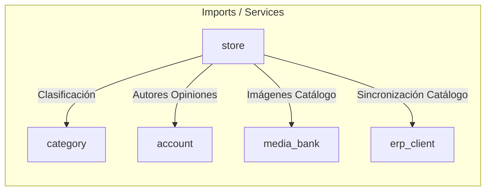

# 📦 Módulo Store — Cerebro Local

## 🎯 Propósito
Este módulo constituye el núcleo de la tienda online: administra el catálogo completo de productos, las variaciones del catálogo (medidas, roscas, durezas), las opiniones y valoraciones de clientes (`reviews`), el centro de ayuda de preguntas frecuentes (`FAQs`), el motor de búsquedas semánticas y el generador dinámico de secciones de la página principal (`Home Page Builder V2`).

## 🕸️ Grafo de Dependencias (Codebase Graph)

*   **Entidades dependientes de este módulo:** 
    *   [cart](../cart/README.md) (CartItem contiene FK a Product y M2M a Variation)
    *   [orders](../orders/README.md) (OrderProduct contiene FK a Product y M2M a Variation)
    *   [blog](../blog/README.md) (Permite asociar productos sugeridos a los artículos)
*   **Módulos requeridos por este módulo:** 
    *   [category](../category/README.md) (Clasifica jerárquicamente los productos en categorías y subcategorías)
    *   [account](../account/README.md) (Vincula autores en las opiniones de productos)
    *   [media_bank](../media_bank/README.md) (ImageAsset actúa como origen de imágenes principal)
    *   [erp_client](../erp_client/README.md) (Permite sincronizar y actualizar el stock y precios del catálogo)

## 🛠️ Modelos Clave / Entidades (DB)
- **Product** (Hereda de `models.Model`): Modela el producto físico. Almacena código de barras/código interno (`code`), medidas (`diameter`, `length`), precios (estándar y en oferta), stock, SEO tags y metadatos para integración publicitaria en redes (Meta Pixel y Google Merchant Feed).
- **ProductGallery** (Hereda de `models.Model`): Colección de imágenes adicionales para el producto.
- **Variation** (Hereda de `models.Model`): Mapea opciones del producto por categorías (ej. Rosca, Material, Medida).
- **ReviewRating** (Hereda de `models.Model`): Modela las reseñas y puntuaciones de usuarios.
- **FAQ** y **FAQCategory** (Hereda de `models.Model`): Estructura las preguntas frecuentes a nivel de catálogo.
- **HomeSection**, **HomeSectionProduct** y **PromoBanner**: Tablas de configuración del *Home Page Builder V2* que permiten estructurar carruseles, accesos rápidos y grids promocionales desde el admin.
- **CarouselImage**: Banners principales del carrusel de bienvenida.

## ⚡ Servicios y Casos de Uso Críticos (services.py)
- **ProductService.filter_products / paginate_products**: Filtra y pagina productos en el listado del catálogo.
- **ProductService.import_products_from_file**: Lee y analiza archivos Excel/CSV utilizando pandas, y actualiza de forma masiva el catálogo (precios y existencias) en modo seco (`--dry-run`) o en base directa.
- **SearchService.search_products**: Implementa búsquedas de productos e indexa palabras de búsqueda en `ProductSearch` para alimentar el autocompletado y análisis de tendencias.
- **ReviewService.create_review**: Gestiona el guardado y actualización de reviews recalculando la media de estrellas del producto.
- **HomeSectionService.get_active_sections**: Obtiene las secciones del Home y resuelve las consultas específicas de sus productos asociados (respetando curaduría manual o fallback automático).
- **GoogleReviewsService**: Consulta e integra calificaciones externas desde la API oficial de Google Maps con almacenamiento en caché de Redis.

## 📝 Notas de Detalle (Obsidian Vault)
- **Algoritmo de Regeneración de Slugs**: Los productos importados reciben slugs temporales automáticos. El sistema detecta cuando el nombre ha sido curado profesionalmente por un operario para gatillar la regeneración limpia y definitiva del slug.
