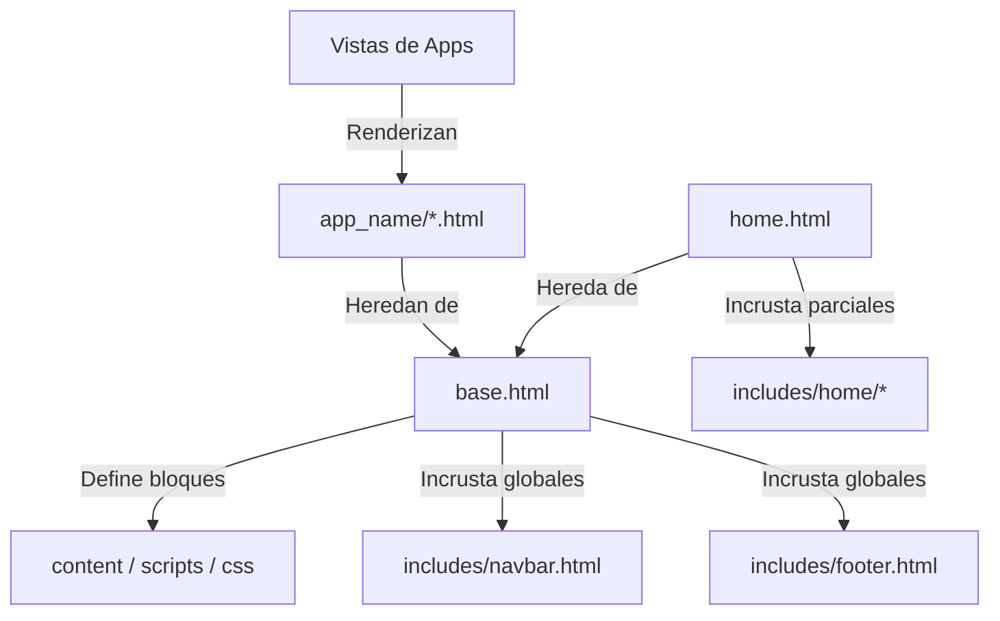

# 🎨 Directorio Templates — Cerebro Local

## 🎯 Propósito
Este directorio centraliza las plantillas HTML5 semánticas de la aplicación web, estructuradas de forma modular e integradas con el framework de estilos TailwindCSS, la biblioteca Alpine.js para interactividad liviana en el cliente y Lucide Icons.

## 🕸️ Estructura y Organización

```
templates/
├── base.html                     ← Master layout base (HTML principal, scripts y metadata SEO)
├── home.html                     ← Plantilla principal de la Home (modularizada con Home Page Builder V2)
│
├── includes/                     ← Componentes parciales y secciones del sistema
│   ├── navbar.html               ← Barra de navegación principal dinámica
│   ├── footer.html               ← Pie de página institucional dinámico
│   ├── alerts.html               ← Notificaciones flotantes (Django messages)
│   └── home/                     ← Secciones dinámicas renderizadas por HomeSectionService
│       ├── _hero_carousel.html   ← Carrusel dinámico de banners
│       ├── _quick_access.html    ← Botones de acceso rápido
│       ├── _product_carousel.html← Carrusel de productos destacables
│       └── ...
│
├── errors/                       ← Plantillas de respuesta para excepciones HTTP
│   ├── 400.html                  ← Bad Request
│   ├── 403.html                  ← Forbidden
│   ├── 404.html                  ← Not Found
│   └── 500.html                  ← Internal Server Error
│
└── {app_name}/                   ← Plantillas específicas por módulo Django (e.g. account, store, cart)
```

## 🕸️ Grafo de Interacciones de Renderizado



## ⚡ Tematización Dinámica (SiteTheme Integration)
Los estilos CSS y los elementos de fondo, textos y bordes de los layouts principales no están hardcodeados; consumen los tokens inyectados dinámicamente por el context processor `site_theme` (definido en `web_bulonera.context_processors.site_theme`).
Ejemplo de inyección de estilos embebidos en el header de `base.html`:
```html
<style>
  :root {
    --color-primary-800: {{ site_theme.primary_800 }};
    --color-accent-500: {{ site_theme.accent_500 }};
  }
</style>
```

## 📝 Reglas de Diseño y Codificación (Alineación con skills)
- **Alineación con `template-standardization` y `design-quality`**: Las plantillas deben evitar código de estilos raw. Toda variación se aplica mediante clases utilitarias de TailwindCSS o tokens CSS customizados.
- **Micro-animaciones**: Se utiliza Alpine.js para la interactividad rápida de componentes del cliente (carruseles, modales de carrito lateral, colapsables) evitando sobrecargar el bundle de Javascript del navegador.
