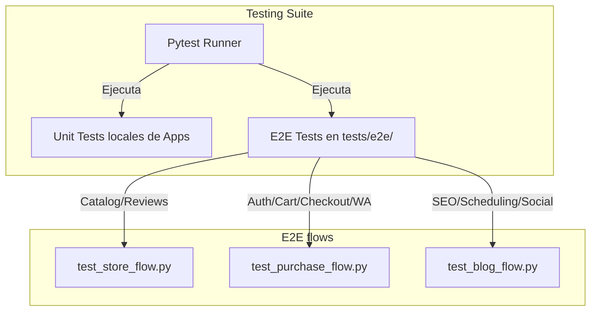

# 🧪 Módulo Tests — Cerebro Local

## 🎯 Propósito
Este directorio centraliza los tests de integración de extremo a extremo (E2E) y de flujos de negocio completos del sistema. Complementa a las suites de tests unitarios que posee cada aplicación individual en sus respectivas carpetas `{app_name}/tests/`.

## 🕸️ Estructura y Organización

```
tests/
├── conftest.py             ← Configuración global y fixtures de pytest (en la raíz)
├── pytest.ini              ← Parámetros globales de ejecución (en la raíz)
│
├── test_api_phase2.py      ← Tests globales de la API REST (Fase 2)
│
└── e2e/                    ← Pruebas de integración E2E por flujos
    ├── test_store_flow.py  ← Flujo de visualización de catálogo y búsqueda
    ├── test_blog_flow.py   ← Flujo de lectura de posts corporativos y SEO tags
    └── test_purchase_flow.py← Flujo completo: agregar a carro -> checkout -> pago
```

## 🕸️ Grafo de Cobertura de Flujos de Negocio



## ⚡ Entorno de Ejecución (Importante)
De acuerdo a la directiva estricta de la skill `docker-environment`, los tests **nunca** deben ejecutarse directamente en la terminal del host. Se deben correr dentro del contenedor de Docker `bulonera_web`.

### Comandos de ejecución:
- **Ejecutar todos los tests del proyecto**:
  ```bash
  docker-compose exec bulonera_web pytest
  ```
- **Ejecutar solo los tests de integración/E2E**:
  ```bash
  docker-compose exec bulonera_web pytest tests/
  ```
- **Ejecutar un archivo de pruebas específico**:
  ```bash
  docker-compose exec bulonera_web pytest tests/e2e/test_purchase_flow.py -v
  ```

## 📝 Notas de Detalle (Obsidian Vault)
- **Fixtures Compartidos (`conftest.py`)**: Centraliza los fixtures de Django REST Framework (APIClient), creación de usuarios de prueba, carga de categorías de prueba y configuración del banco de imágenes para simular transacciones de forma aislada sin persistir basura en el entorno de desarrollo local.
