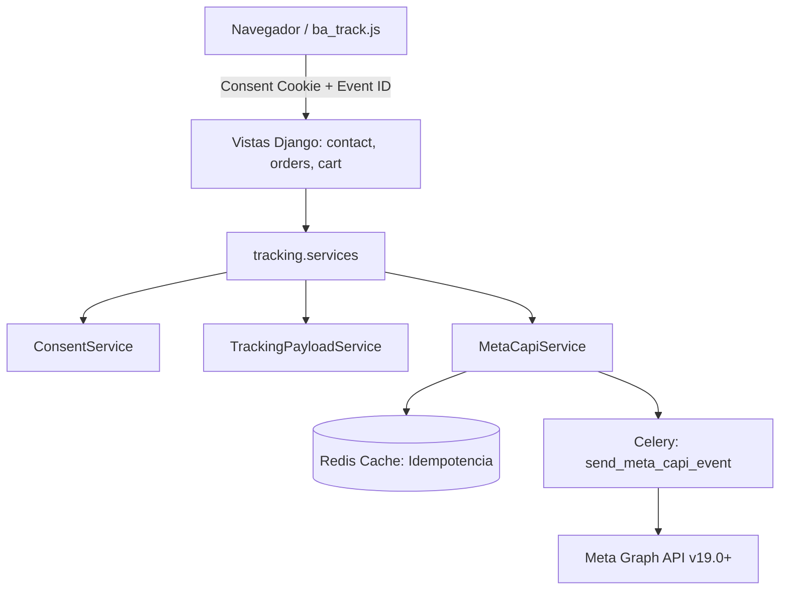

# 📦 Módulo Tracking — Cerebro Local

## 🎯 Propósito
Este módulo centraliza la arquitectura de telemetría, privacidad y medición server-side (Meta Conversions API - CAPI) de BULONERA WEB (ADR-10). Es una aplicación Django sin modelos de base de datos cuyo único propósito es normalizar payloads, garantizar la protección de datos personales (PII) bajo estricto consentimiento y encolar eventos de conversión asíncronos hacia Meta Graph API.

## 🕸️ Grafo de Dependencias (Codebase Graph)

* **Entidades dependientes de este módulo:** `orders`, `cart`, `contact`, `store`.
* **Módulos requeridos por este módulo:** `web_bulonera.utils` (`get_client_ip`), Redis / LocMem Cache, Celery.

## 🛠️ Servicios Clave y Casos de Uso (services.py)

### 1. `ConsentService`
* **`has_advertising_consent(request)`**: Inspecciona la cookie espejo `ba_consent` verificando que el flag publicitario `d=1` esté activo. Si no hay consentimiento o la cookie está ausente/malformada, aborta cualquier envío CAPI.
* **`has_analytics_consent(request)`**: Verifica el flag de analítica `a=1` para telemetría general.

### 2. `TrackingPayloadService`
* **`hash_value(value)`**: Normaliza (trim + lowercase) y calcula el hash criptográfico SHA-256 de identificadores PII (`em`, `ph`, etc.) para maximizar el Event Match Quality (EMQ) en Meta.
* **`extract_user_data(request)`**: Extrae IP del cliente (vía `get_client_ip`), User-Agent, cookies de Meta (`_fbp`, `_fbc`) y datos PII hasheados si el usuario está autenticado.
* **`build_purchase_custom_data(order)`**: Genera el objeto `custom_data` para el evento `Purchase`, respetando la regla ADR-01 (`contents[].id = product.code`) y forzando valores numéricos a `float` nativo.
* **`build_addtocart_custom_data(product, quantity)`**: Genera el payload normalizado para `AddToCart`.

### 3. `MetaCapiService`
* **`enqueue_purchase(order, request)`**: Encola asíncronamente el evento `Purchase` con `event_id = purchase.{order_number}` e idempotencia de 7 días.
* **`enqueue_add_to_cart(request, product, quantity, event_id)`**: Encola el evento `AddToCart` deduplicado mediante el `event_id` provisto por el frontend.
* **`enqueue_generate_lead(request, lead_method, event_id)`**: Encola el evento `Lead` para clics a WhatsApp (vía `whatsapp_lead_redirect`) o envíos de formulario de contacto, registrando el `lead_event_source` (`source`) específico para atribución granular.

## ⚡ Tareas Asíncronas (tasks.py)
* **`send_meta_capi_event(event_name, event_id, user_data, custom_data)`**: Tarea Celery con reintento exponencial automático (`autoretry_for=(RequestException,)`, `max_retries=3`) ante errores de red o caídas `5xx` de Meta Graph API. Los errores cliente `4xx` se descartan limpiamente sin saturar la cola.

## 🧪 Pruebas Automatizadas
* Ubicación: [`tracking/tests/`](tests/)
* `test_services.py`: 21 tests unitarios cubriendo sanitización, extracción, hashing, guards de consentimiento e idempotencia de Celery/Cache.
* `test_tasks.py`: 4 tests de integración validando consumo de Graph API y políticas de retry con requests mockeado.
