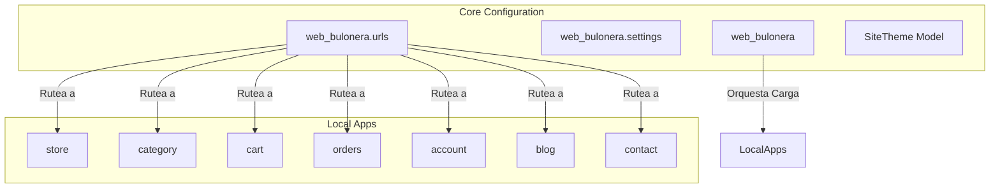

# 📦 Módulo web_bulonera — Cerebro Local

## 🎯 Propósito
Este módulo constituye el núcleo de configuración, ruteo general y orquestación del proyecto Django. Contiene los archivos de configuración (`settings/`), la configuración de tareas en segundo plano (`celery.py`), middlewares transversales, manejadores de errores y el modelo de tematización visual dinámica (`SiteTheme`).

## 🕸️ Grafo de Dependencias (Codebase Graph)

*   **Entidades dependientes de este módulo:** Todas las aplicaciones locales (heredan configuraciones del proyecto, settings de base de datos, caché y orquestación de URLs).
*   **Módulos requeridos por este módulo:** 
    *   [category](../category/README.md) (Se inyecta en context processors generales)
    *   [store](../store/README.md) (Se inyecta en el ruteo central e interactúa con el tema)

## 🛠️ Modelos Clave / Entidades (DB)
- **SiteTheme** (Hereda de `models.Model`): Modelo tipo Singleton (máximo una sola instancia en BD) que permite a los administradores ajustar en tiempo real el diseño y los colores del sitio (gamas cromáticas en HEX para botones, navbars, opacidades y fondos) desde el Panel de Administración de Django sin necesidad de redeploy.

## ⚡ Componentes Críticos y Context Processors
- **Settings Multi-Entorno (`settings/`)**:
  - `base.py`: Configuraciones compartidas del stack (Django, DRF, Celery, Redis, etc.).
  - `local.py`: Variables e instrumentación específicas de desarrollo.
  - `production.py`: Configuraciones de alta seguridad (SSL, cabeceras, tokens) para el servidor productivo VPS.
- **Context Processors (`context_processors.py`)**:
  - `meta_settings`: Inyecta automáticamente variables globales en los templates (e.g. `WHATSAPP_NUMBER`, `META_PIXEL_ID`, claves de Google Maps).
  - `site_theme`: Inyecta el tema activo de colores (`SiteTheme`) en todos los templates con almacenamiento en caché de Redis por 1 hora.
- **Middlewares (`middleware.py`)**:
  - `ErrorLoggingMiddleware`: Captura y registra excepciones imprevistas en los logs del servidor.

## 📝 Notas de Detalle (Obsidian Vault)
- **Invalida Caché**: Cada vez que se actualiza el tema visual en el panel de control, el método `save()` de `SiteTheme` purga la clave `site_theme_active` de Redis para aplicar los cambios estéticos de manera instantánea.
